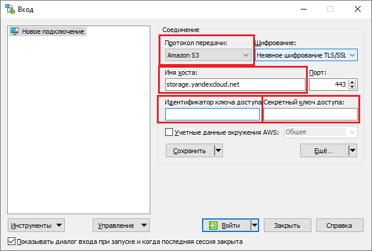
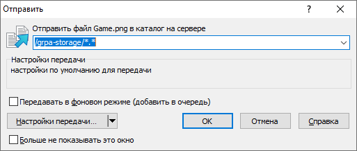
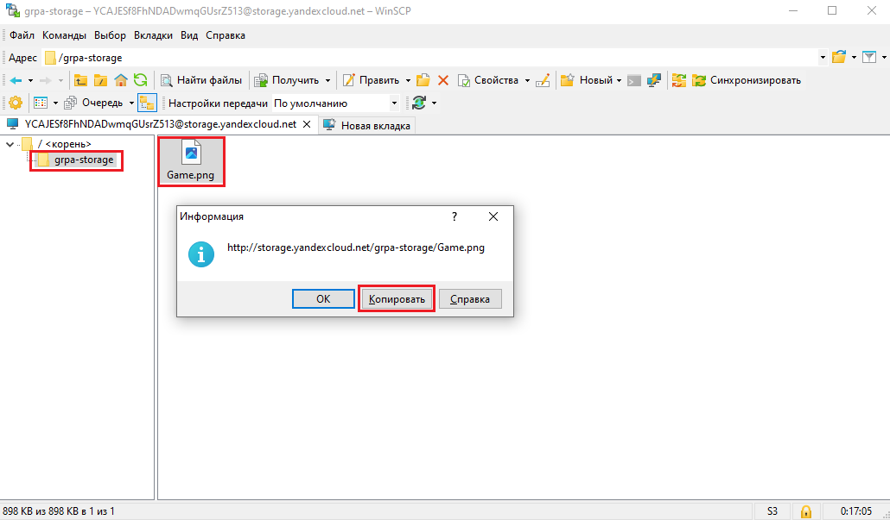
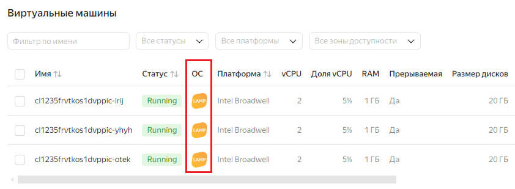
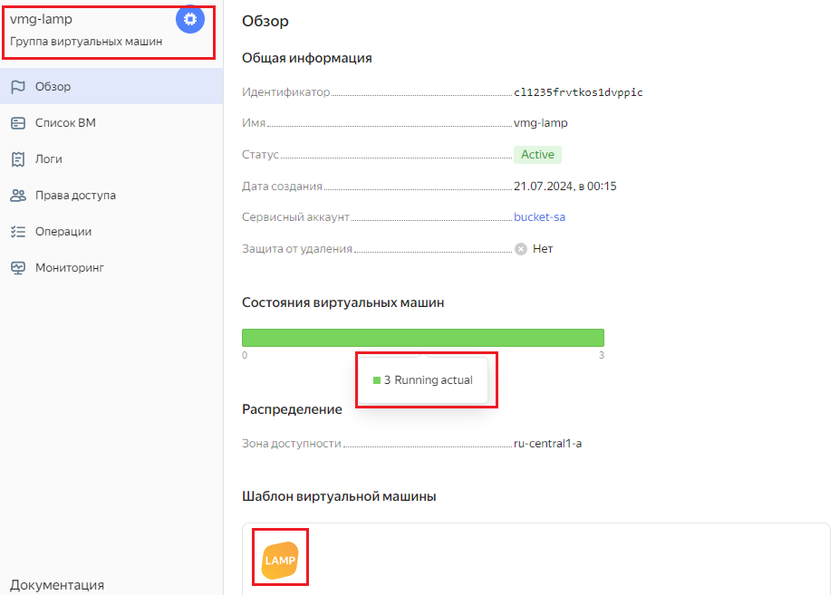
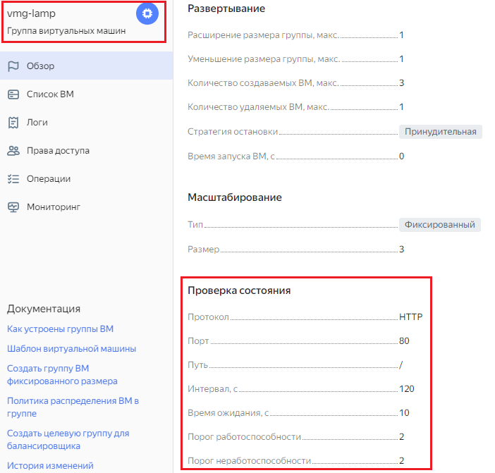
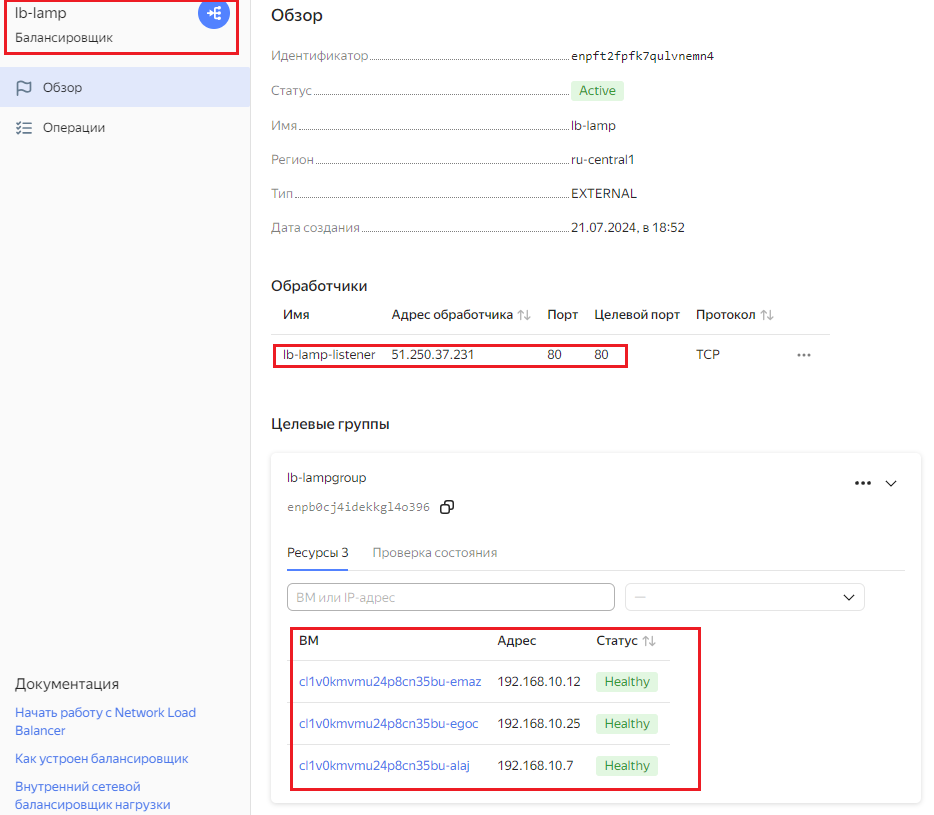
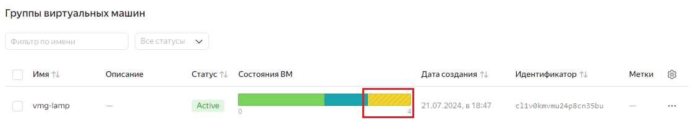
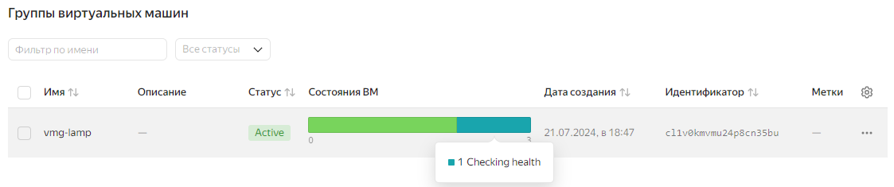
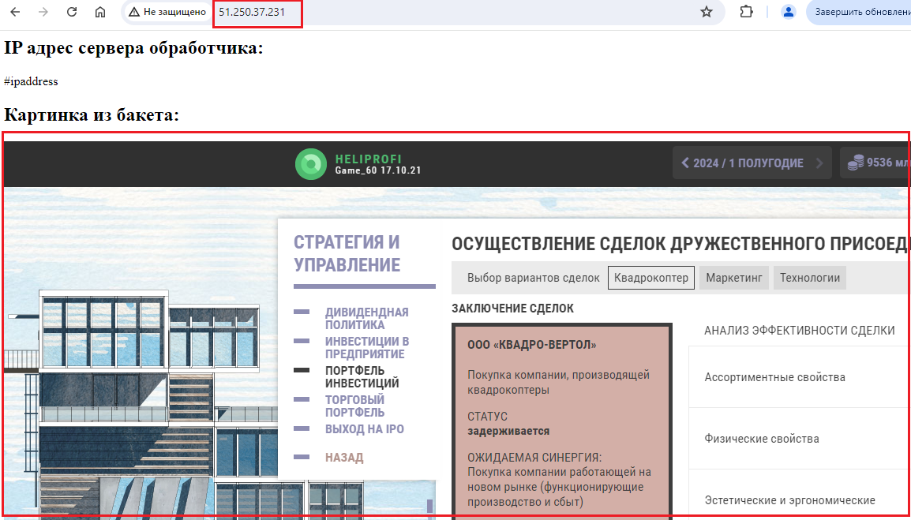

## Задание 1. Yandex Cloud 

**Что нужно сделать**

1. Создать бакет Object Storage и разместить в нём файл с картинкой:

 - Создать бакет в Object Storage с произвольным именем (например, _имя_студента_дата_).
 - Положить в бакет файл с картинкой.
 - Сделать файл доступным из интернета.
 
2. Создать группу ВМ в public подсети фиксированного размера с шаблоном LAMP и веб-страницей, содержащей ссылку на картинку из бакета:

 - Создать Instance Group с тремя ВМ и шаблоном LAMP. Для LAMP рекомендуется использовать `image_id = fd827b91d99psvq5fjit`.
 - Для создания стартовой веб-страницы рекомендуется использовать раздел `user_data` в [meta_data](https://cloud.yandex.ru/docs/compute/concepts/vm-metadata).
 - Разместить в стартовой веб-странице шаблонной ВМ ссылку на картинку из бакета.
 - Настроить проверку состояния ВМ.
 
3. Подключить группу к сетевому балансировщику:

 - Создать сетевой балансировщик.
 - Проверить работоспособность, удалив одну или несколько ВМ.
4. (дополнительно)* Создать Application Load Balancer с использованием Instance group и проверкой состояния.

Полезные документы:

- [Compute instance group](https://registry.terraform.io/providers/yandex-cloud/yandex/latest/docs/resources/compute_instance_group).
- [Network Load Balancer](https://registry.terraform.io/providers/yandex-cloud/yandex/latest/docs/resources/lb_network_load_balancer).
- [Группа ВМ с сетевым балансировщиком](https://cloud.yandex.ru/docs/compute/operations/instance-groups/create-with-balancer).

## 1. Создание бакета и размещение файлов в нем

Создание бакета вынесено в отдельный модуль, расположенный в [папке](terraform/modules/bucket)

1. Манифест создания бакета расположен в [файле](terraform/modules/bucket/main.tf)
   - Все входящие переменные модуля обязательны:

   |  Название переменной      |          Описание                                                                                                              |
   |---------------------------|--------------------------------------------------------------------------------------------------------------------------------|
   | folder_id                 | Идентификатор папки в облаке                                                                                                   |
   | account_name              | Имя сервисного аккаунта. По умолчанию равно **sa**                                                                             |
   | bucket.name               | Название бакета. По умолчанию **grpa-storage**                                                                                 |
   | bucket.acl                | Установленный ACL. По умолчанию ***public-read***. Можно использовать предопределенные ACL: <ul> <li>private (доступ на основе ролей в облаке)</li><li> public-read (доступ всем пользователям на чтение)</li><li> public-read-write(доступ всем пользователям и на чтение и на запись)<li> authenticated-read (только аутентифицированные пользователи получают доступ на чтение) </li></ul>   |
   | bucket.type              | Тип хранилища. Возможны варианты: STANDARD, COLD и ICE                                                                          |
   | bucket.max_size          | Максимальный размер бакета в байтах. По умолчанию имеет значение эквивалентное 10Мб                                             |
   | bucket.force_destroy     | Позволяет удалить бакет вместе с находящимися в нем данными если установлено значение ***true***. По умолчанию равно ***true*** |
 
   - Исходящие переменные модуля:

   | Название переменной      |         Описание                                                                                                    |
   |--------------------------|---------------------------------------------------------------------------------------------------------------------|
   | static_key_id            | Идентификатор ключа доступа. Указывается при создании подключения в WinSCP. Можно узнать командой: ```yc iam access-key list  --service-account-name <имя сервисного аккаунта>``` |
   | static_key_secret        | Секретный ключ доступа. Указывается при создании подключения в WinSCP. После создания недоступен                    |


2. Файл размещаем через программу winscp:
   - скачиваем winSCP(например [отсюда](https://winscp.net/eng/download.php) )
   - в программе выбираем создание нового подключения ***Amazon S3***
   - в качестве имени хоста указываем значение ***storage.yandexcloud.net*** 
   - в качестве идентификатора ключа доступа используем значение ***static_key_id***
   - в качестве секретного ключа доступа используем значение ***static_key_secret***

   Указанные значения вводим при создании нового подключения в WinSCP:
   

   После подключения вставляем [файл](images/Game.png) в бакет
    - копируем [файл](images/Game.png) в  буфер обмена(Ctrl+C) 
    - в окне WinSCP вставляем файл командой вставки файла из буфера(Ctrl+V). Появляется диалог вставки файла. В этот момент можно указать другой путь вставки. Диалог имеет вид:

       
      
      После нажатия на кнопку **Ok** файл загружается. 
    - В окне WinScp переходим в бакет. 
    - Нажимаем правой кнопкой мыши по файлу и выбираем команду **Файловые пользовательские команды -> Сгенерировать URL для протокола HTTP**
    - Получаем диалоговое окно со ссылкой на файл в бакете. Нажимаем кнопку "Копировать", чтобы скопировать адрес в буфер обмена.
   
      
 
   В итоге файл доступен по ссылке: https://storage.yandexcloud.net/grpa-storage/Game.png
   Т.к. при создании бакета использовалась предопределенная ACL - **public-read**, то файл уже доступен на чтение из интернета.

# 2. Создание группы ВМ в public подсети фиксированного размера с шаблоном LAMP и веб-страницей, содержащей ссылку на картинку из бакета

Создание группы ВМ сделано в виде отдельного модуля, который доступен в [папке](terraform/modules/vmgroup) 

1. Манифест с описанием создания группы ВМ находится в [файле](terraform/modules/vmgroup/main.tf)
   - Все входящие переменные модуля обязательны:

   |  Название переменной      |          Описание                                                                                                              |
   |---------------------------|--------------------------------------------------------------------------------------------------------------------------------|
   | folder_id                 | Идентификатор папки в облаке                                                                                                   |
   | account_name              | Имя сервисного аккаунта. По умолчанию равно **sa**                                                                             |
   | vmg_name                  | Имя группы ВМ. По умолчанию **vmg-lamp**                                                                                       |
   | vpc_name                  | Имя облачной сети. По умолчанию **develop**. Внутри сети автоматически создается подсеть **public**                            |
   | default_zone              | Зона доступности в которой будет создаваться группа. По умолчанию равна **ru-central1-a**                                      |
   | vms_resources             | Параметры ВМ(ЦП, память, диск)                                                                                                 |
   | lb_name                   | Имя балансировщика нагрузки                                                                                                    |
   | lb_netgroupname           | Имя сетевой группы балансировки, к которой будут присоединены ВМ и сам балансировщик нагрузки.                                 |
   | lb_apigroupname           | Имя прикладной группы балансировки, к которой будут присоединены ВМ и сам балансировщик нагрузки.                              |

   - Исходящие переменные модуля:

   |  Название переменной      |          Описание                                                                                                              |
   |---------------------------|--------------------------------------------------------------------------------------------------------------------------------|
   | vmg_id                    | Идентификатор группы ВМ                                                                                                        |

2. Картинка из бакета публикуется на стартовой странице путем добавления разметки в [файл cloud-init.yml](terraform/cloud-init.yml):
   ```
      write_files:
        - content: |
            <html lang="ru">
               <head>
                  <meta charset="UTF-8">
                  <title>Картинка</title>
               </head>
               <body>
                <h2>Картинка из бакета:</h2>
                
               </body>
            </html>
          path: /var/www/html/index.html
   ```
3. Проверка состояния ВМ осуществляется добавления блока **health_check** в группу ВМ и имеет вид:
   ```
      health_check {
        interval = 60 # Интервал между проверками. Указывается в секундах
        timeout = 5 # Указывается в секундах
        healthy_threshold = 2 # Количество успешных запросов после которых экземпляр признается успешным, может принимать значения 0 или от 2 до 10. 
        unhealthy_threshold = 2 # Количество неуспешных запросов после которых экземпляр признается неуспешным, может принимать значения 0 или от 2 до 10
        tcp_options {
            port = 80
        }
      } 
   ```

В итоге в консоли yandex видим:
-  создались 3 машины с образом LAMP:
   
- Создалась группа машин состоящая из этих 3 машин:
  
- Настроена проверка состояния ВМ:
  

## 3. Подключение группы инстансов к  к сетевому балансировщику
Создание балансировщика нагрузки сделано в виде отдельного модуля, который доступен в [папке](terraform/modules/networklb)

1. Манифест создания балансировщика находятся в [файле](terraform/modules/networklb/main.tf)
  - Все входящие переменные обязательны:  

      | Имя переменной |          Описание                                                                                                  |
      |----------------|--------------------------------------------------------------------------------------------------------------------|
      | lb_name        | Имя балансировщика. По умолчанию **lb-lamp**                                                                       | 
      | vmg_id         | Идентификатор группы ВМ. Можно использовать исходящее значение vmg_id модуля **vmgroup**: ```module.vmgroup.vmg_id | 

2. Развернуть балансировщик можно отдельной командой:
   ```terraform apply --target module.networklb```

3. Вид yandex-консоли с развернутым балансировщиком
   

4. В процессе обновления группы ВМ
   - Происходит удаление ВМ по 1 за раз :
      

   - Проверка доступности новых экземпляров ВМ
      

4. Вид страницы с фото:
   
   

